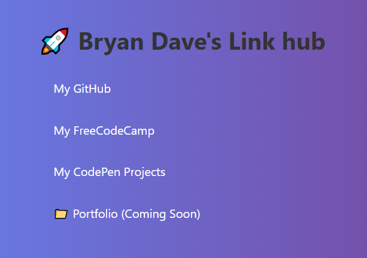

# 🔗 Project 13: Link Hub App

A clean and responsive personal link hub built using HTML and CSS.  
Inspired by platforms like Linktree, this app showcases all of Bryan Dave's essential dev links in one page.

---

## 📌 Features

- Clickable buttons linking to:
  - GitHub Profile
  - FreeCodeCamp Progress
  - CodePen Projects
  - Placeholder for Portfolio
- Styled layout with centered content
- External links open in a new tab (`target="_blank"`)
- Fully manual typed (no copy-paste 🔥)
- Simple & responsive design

---

## 🛠️ Tools Used

| Tool | Purpose |
|------|---------|
| HTML | Webpage structure |
| CSS  | Styling & layout |
| `<a href>` | Hyperlinks for navigation |

---

## 🎯 How to Use

1. Clone or download the project
2. Open `index.html` in your browser
3. Click the buttons to access links

You can customize the links by editing the `href` values inside the HTML.

## 📷 Screenshot

---

## 🙌 Author

Built with discipline and quiet consistency by **Bryan Dave** 🧙‍♂️  
> "Coding isn't just logic – it's self-mastery in every keystroke."
